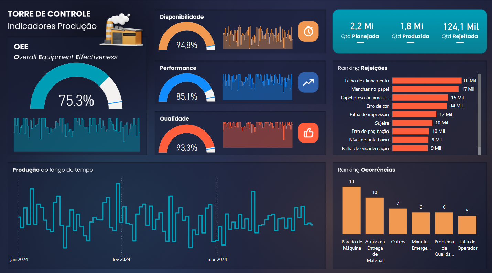

# Dashboard de produção
Neste Dashboard, busquei realizar o processo de ETL em um arquivo txt que foi gerado por uma máquina (foi criado um caso hipotético)
Além do processo de ETL, realizei a criação de gráficos KPI, que são indicadores muito utilizados para uma melgor visualização dos dados.
